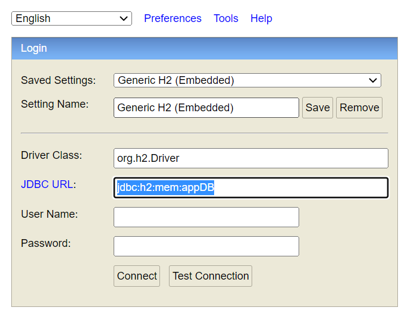
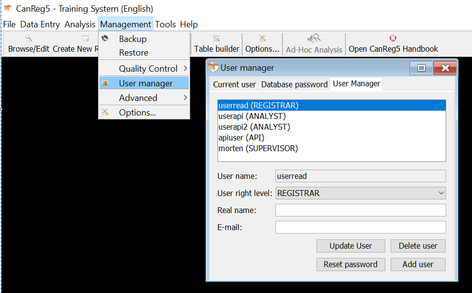

CanReg API user guide
=========================
CanReg API is a Spring boot application allowing user to import their records into a holding database. It
uses [CanReg](https://github.com/IARC-CSU/CanReg5) as a dependency.

# Summary

- [Run CanReg-API](#Run-CanReg-API)
    - [Local Run](#local-run)
- [Log in into CanReg API](#login-into-canreg-api)
- [Database](#database)
- [Swagger UI](#swagger-ui)
- [Implementation](#implementation)
    - [Metadata GET entry points](#metadata-get-entry-points)
    - [Business SET entry points](#business-set-entry-points)
    - [Bulk import](#bulk-import)
    - [Bulk import worker](#bulk-import-worker)
- [Security](#security)
    - [User management](#user-management)

----------------------------------

# Run CanReg API

## Local run

### Before launching the API

CanReg API uses CanReg application as a package, please make sure to build the application with the branch rest-api
before.

### Run in IDE

Once the project is downloaded and imported in your IDE, please start CanReg application and its database server first
before you launch the api (see instruction in the section [database](#database))

The Main class of this spring boot application is: CanRegApiApplication. In order to launch it locally using
application-local.properties, you need the following VM option:

  ```
  -Dspring.profiles.active=local
  ```

## Login into CanReg API

Once the API application started, you can log in into the API and access to its endpoints or other functionalities (h2 console, swagger).

To log in to CanReg API, you need a user with role API. This can be managed with [user manager](#user-management) in CanReg.

## Database

The API uses CanReg's database to store system related information. Therefore, the application should be started before
the API.

### Start CanReg database

Once you have started and connected to CanReg, go to Management -> Advanced -> Start database server.

<p align="center">
 
</p>

A pop-up window will be shown with the message "Database started".

### Embedded H2 database

The embedded database use to store import [worker](#worker) information is an H2 database, it can be accessed using the
following link locally:

```
http://localhost:8080/h2-console
```

This access link can be changed with `spring.h2.console.path` in properties.



If you have already [logged into API](#user-management), you can connect to h2 database without user and password. This can be changed in properties. 

!!! please make sure in the above interface that the jdbc URL is correct before connecting !!!

### Holding database

Data is imported in a holding database different from the current database. This is similar to what is done in the
existing "import" feature in CanReg5.

At startup, if not already existing, CanReg5 server creates one holding database for each rest user.
About user and role, more details [here](#user-management).

- The database schema is: "HOLDING_" + registryCode + "_" + userName (without spaces and quotes). Please refer to
  CanRegServerImpl.getRegistryCodeForApiHolding in CanReg5 for more details.
- One CanRegDAO is created for each api user that calls the API: see HoldingDBHandler
    - The dao are stored in a maps to avoid creating them at each call.
- For more details about database initialization, please check CanRegServerImpl.initHoldingDbsForApiUsers in CanReg.

# Swagger UI

The Swagger can be accessed using the following link:

```
http://localhost:8080/swagger-ui.html
```

This swagger gives easy access to endpoints available. You can use them by giving corresponding arguments, this could be
checked in the section [implementation](#Implementation)

# Implementation

## Metadata GET entry points

#### Get system description xml file with its registry code

Get the system description file in `.CanRegServer/System`, the registry code can be found on the login interface of
CanReg.

- GET /api/meta/system/{registryCode}
    - registryCode: system registry code

#### Get a particular dictionary from CanReg with its id

- GET /api/meta/dictionary/{dictionaryId}
    - dictionaryId

Result example:

```      
{
      "dictionaryID": 0,
      "name": "Record status",
      "font": "Latin",
      "type": "Simple",
      "codeLength": 0,
      "categoryDescriptionLength": 0,
      "fullDictionaryCodeLength": 1,
      "fullDictionaryDescriptionLength": 10,
      "locked": false,
      "allowCodesOfDifferentLength": false,
      "compoundDictionary": false,
      "dictionaryEntries": {
        "0": {
        "dictionaryID": 984,
        "code": "0",
        "description": "Pending"
        },
        "1": {
        "dictionaryID": 985,
        "code": "1",
        "description": "Confirmed"
        },
        "2": {
        "dictionaryID": 986,
        "code": "2",
        "description": "Deleted"
        }
      },
      "compound": false,
      "unkownCode": null,
      "descriptiveString": "Record status (Simple, Full length: 1)"
  }
```

#### Get all dictionaries in CanReg

- GET /api/meta/dictionary/all

## Business SET entry points

#### Create a patient

- POST /api/patients

Input example:

```
  {
    "variables": {
      "regno": "20991551",
      "pers": "1",
      "stat": "D",
      "patientcheckstatus": "",
      "race": "",
      "causeofdeath": "",
      "sex": "1",
      "patientupdatedby": "morten",
      "deathdate": "20060618",
      "patientrecordstatus": "",
      "civils": "",
      "maidn": "",
      "obsoleteflagpatienttable": "0",
      "famn": "ROMANO",
      "firstn": "JEREMIAH",
      "midn": "",
      "occu": "",
      "patientupdatedate": "20110510",
      "dlc": "20060618",
      "patientrecordid": "2005557202",
      "birthd": "19990909"
    }
  }
```

- 201: patient created
    - the content of the created Patient is returned with created ids and with possible warnings in the variable "
      format_errors"

  ```
      "format_errors": [
        {
          "variableName": "birthd",
          "variableValue": "",
          "message": "this variable is mandatory",
          "error": false
        }
      ]
  ```

- 409: patient already exists with the same RegNo, or with the same PatientRecordID
  ```
  {
    "timestamp": 1645171082093,
    "status": 409,
    "error": "Conflict",
    "message": "Patient already exists with the same RegNo",
    "path": "/api/setPatients"
  }    
  ```
- 400: validation error
  ```
  {
    "timestamp": 1645170918683,
    "status": 400,
    "error": "Bad Request",
    "message": "Validation failed: [{level='error', variable='birthd', value='1920-01-20', message='this date is not a valid date yyyyMMdd'}]",
    "path": "/api/setPatients"
  }    
  ```

#### Create a tumour

- POST /api/tumour

```
  {
      "variables": {
          "extent": "LC",
          "incid": "19990205",
          "mptot": "",
          "beh": "3",
          "obsoleteflagtumourtable": "0",
          "mpseq": "1",
          "i10": "C859",
          "mpcode": "",
          "update": "20110510",
          "iccc": "",
          "patientidtumourtable": "20991551",
          "chec": "1",
          "laterality": "",
          "tumourid": "209915510101",
          "mor": "9590",
          "top": "99",
          "bas": "7",
          "recs": "1",
          "tumourupdatedby": "morten",
          "tumourunduplicationstatus": "",
          "addr": "",
          "patientrecordidtumourtable": "2099155101",
          "age": 24
      }
  }
```

- 201: tumour created
- 400: validation error
- 404: the linked patient is not found
- 409: tumour already exists

#### Create a source

- POST /api/source
    - 201: source created
    - 400: validation error
    - 404: the linked tumour is not found
    - 409: source already exists

#### Create a new population dataset

- POST /api/population
    - creates a new dataset in the main database
    - uses the same json structure as the export of a dataset in CanReg5
    - error if the dataset already exists

#### Edit a exists population dataset

- PUT /api/population
    - edit exists population dataset in the main database
    - uses the same json structure as the export of a dataset in CanReg5
    - error if the dataset already not exists

#### Edit exists patient in holding db with idRecord

- PUT /api/patients
    - 200: patient updated
    - 400: validation error
    - 404: the patient is not found

#### Edit exists tumour in holding db with id

- PUT /api/tumours
    - 200: tumour updated
    - 400: validation error
    - 404: the tumour is not found
    - 409: the linked patient is not found

#### Edit exists source in holding db with idRecord

- PUT /api/sources
    - 200: source updated
    - 400: validation error
    - 404: the source is not found
    - 409: the linked tumour is not found

## Bulk import

This will import the selected file to the holding database of the current connected user. Imported file will be stored
at `target/upload` by default, this can be changed with `bulkUploadDir` in properties.
Report will be stored by default at `${user.home}/.CanRegAPI/report`, this can be changed with `bulkReportDir` in
properties.

If `bulkUploadDirDeleteOnStartup` is set to true in properties, directories content will be deleted on start up.

More details in section [holding database](#holding-database).

#### Import file

- POST /bulk/import/{dataType}/{encodingName}/{separatorName}/{behaviour}/{writeOrTest}
    - input data
        - csvFile: multipart/form-data
        - dataType: PATIENT or TUMOUR or SOURCE
        - encodingName: a valid charset name, like UTF-8
        - separatorName: TAB or COMMA
        - behaviour:
            - CREATE_ONLY: create records only (no update of existing record)
            - to be implemented: REJECT, UPDATE, OVERWRITE
        - writeOrTest:
            - WRITE: write the data
            - TEST: test only
    - result:
        - 200: the file was processed, with or without warning and errors
      ```
      Starting to import patients from sources_small.tsv
      1: OK
      2: KO: Tumour does not exist: INSERT on table 'SOURCE' caused a violation of foreign key constraint 'SQL220209160256010' for key (200662160101).  The statement has been rolled back.
      3: KO: [{level='error', variable='date', value='1945-01-13', message='this date is not a valid date yyyyMMdd'}, {level='error', variable='source', value='062', message='this code is not in the dictionary'}]
      
      Finished: 3 items in input: 1 written, 2 skipped.    
      ```
        - 400: error in an input parameter
      ```
      {
      "timestamp": 1645721039266,
      "status": 400,
      "error": "Bad Request",
      "message": "behaviour must be a valid value, like: CREATE_ONLY",
      "path": "/bulk/import/SOURCE/UTF-8/TAB/CREATE_ONLY2/WRITE"
      }    
      ```
        - 500: server error

#### Import file with worker

Import the file using a worker, worker related details can be found [here](#worker).

- POST /bulk/importWithWorker/{dataType}/{encodingName}/{separatorName}/{behaviour}/{writeOrTest}
    - input data
        - csvFile: multipart/form-data
        - dataType: PATIENT or TUMOUR or SOURCE
        - encodingName: a valid charset name, like UTF-8
        - separatorName: TAB or COMMA
        - behaviour:
            - CREATE_ONLY: create records only (no update of existing record)
            - to be implemented: REJECT, UPDATE, OVERWRITE
        - writeOrTest:
            - WRITE: write the data
            - TEST: test only
    - result:
        - 200: the file was uploaded, with or without warning and errors. The created worker's id will be returned
      ```
      1
      ```
        - 400: error in an input parameter
      ```
      {
      "timestamp": 1645721039266,
      "status": 400,
      "error": "Bad Request",
      "message": "behaviour must be a valid value, like: CREATE_ONLY",
      "path": "/bulk/importWithWorker/SOURCE/UTF-8/TAB/CREATE_ONLY/WRITE"
      }    
      ```
        - 500: server error

## Bulk import worker

### Worker

If the file is imported using a worker, it will be stored.
A worker is set to run every minute 5 to check the if there are file non-imported. If it is the case, the worker will
import the oldest file among them.

Worker's information are stored in the [H2 database](#embedded-h2-database).

!!! parameters must be in CAPITAL LETTERS !!!

#### Get worker report

- GET /api/worker/report/{id}
    - input data:
        - worker id
    - result:
        - 200: return the report of the corresponding worker
      ```
      Starting to import patients from randomPatientRecord.csv
      1: OK
      2: OK
      3: KO: Patient already exists with the same RegNo
      
      Finished: 3 items in input: 2 written, 1 skipped.
      ```
        - 400: error in an input parameter
        - 500: server error

#### Get worker status

- GET /api/worker/status/{id}
    - input data:
        - worker id
    - result:
        - 200: return worker's current status
      ```
      WAITING
      ```
        - 400: error in an input parameter
        - 500: server error

# Security

CanReg API uses Spring Security and Basic Authentication as a standard protection.

This type of security is suitable for intranet use. If deployed to internet, extra configuration will be needed to avoid security issues such as DDoS attacks.

## User management

User can be managed using user manager in CanReg.

<p align="center">
  
</p>

The role used to access api functionalities is currently `API`.
This type of user can only access to CanReg through API and cannot log into CanReg client. 

!!! Please make sure the CanReg application you are using has API as role defined to init [holding database](#holding-database) !!!

This can be checked in CanRegServerImpl.initHoldingDbsForApiUsers in CanReg.


